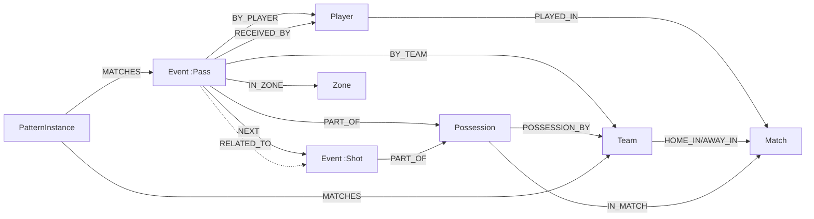

# KG Schema — Temporal Football Knowledge Graph

Target system: Neo4j 5 (property graph). Source: StatsBomb Open Data v4 event format
(`open-data/doc/Open Data Events v4.0.0.pdf`), Premier League 2015/16 (competition 2, season 27).

## Design goals (LO7: schema design)

The schema is driven by what the tactical patterns need:

1. **Temporal order** — patterns are *sequences* ("pressure, then recovery within Δt").
2. **Possession grouping** — patterns live inside (or across) possession chains.
3. **Spatial context** — patterns reference pitch areas ("own half", "wide lane", "final third").
4. **Participation** — who did it (player) and for whom (team), to aggregate per team.

## Data model choice (LO4)

We use a **temporal property graph**: events are first-class nodes carrying time properties,
ordered by explicit `NEXT` edges. Compared against alternatives:

| Model | Why not / trade-off |
|---|---|
| Relational tables | The natural form of the source data — but sequence patterns become self-join chains; recursion (variable-length sequences) needs recursive CTEs and is awkward to read. |
| RDF triples | Statement-level metadata (time on a relation) needs reification or RDF-star; n-ary event data (one event = ~10 attributes) explodes into many triples. Property graph keeps an event as one node with properties. |
| Temporal KG (interval-annotated edges) | Fits slowly-changing facts (transfers, contracts); our data is a dense *event stream* — event-as-node is the standard modelling for that. |
| Property graph (chosen) | Events as nodes with properties; sequences = paths; pattern queries = path patterns. Maps 1:1 to Cypher and to Datalog facts. |

Temporal modelling: `(:Event)-[:NEXT]->(:Event)` (total order per match via StatsBomb `index`)
plus properties `period, minute, second, timestamp_s, idx` for Δt arithmetic. Possessions
reify the StatsBomb possession counter as nodes, giving sequence containers.

## Nodes

| Label | Key | Properties | Notes |
|---|---|---|---|
| `:Match` | `match_id` | `date, kickoff, week, home_score, away_score, stadium, referee` | from `matches/2/27.json` |
| `:Team` | `team_id` | `name` | 20 PL teams |
| `:Player` | `player_id` | `name, country` | from lineups |
| `:Event` | `event_id` (uuid) | `idx, period, minute, second, timestamp_s, type, play_pattern, x, y, duration, under_pressure, counterpress, off_camera` | **every** event of a match becomes a node (chain integrity); `timestamp_s` = seconds since period start |
| `:Possession` | `(match_id, possession)` | `possession, play_pattern` | groups events sharing StatsBomb `possession` number |
| `:Zone` | `zone_id` | `third, channel, name` | static 3×3 grid, see below |
| `:PatternInstance` | generated | `pattern, params, …` | created by Phase-3 rules (derived knowledge — the KG grows by reasoning) |

**Event subtype labels** (extra label next to `:Event`) for the core detail types, with
type-specific properties:

| Label | Extra properties | Extra relationships |
|---|---|---|
| `:Pass` | `length, height, body_part, pass_type, outcome, end_x, end_y, cross, switch, through_ball` | `[:RECEIVED_BY]->(:Player)` |
| `:Shot` | `xg, outcome, technique, body_part, end_x, end_y` | |
| `:Carry` | `end_x, end_y` | |
| `:Pressure` | `duration, counterpress` | |
| `:BallRecovery` | `recovery_failure` | |
| `:Interception`, `:Duel`, `:Dribble`, `:Clearance`, `:Block`, `:Dispossessed`, `:FoulCommitted`, `:FoulWon`, `:Goalkeeper`, `:BallReceipt` | `outcome` where present | |

All other event types (Substitution, Half Start/End, Injury Stoppage, …) become plain
`:Event` nodes with common properties only — they keep the `NEXT` chain unbroken and can be
upgraded later without re-ingesting (schema evolution, LO8).

## Relationships

| Relationship | From → To | Properties | Purpose |
|---|---|---|---|
| `[:NEXT]` | Event → Event | | total temporal order within a match (by `idx`) |
| `[:PART_OF]` | Event → Possession | | possession grouping |
| `[:IN_MATCH]` | Possession → Match | | scoping |
| `[:BY_TEAM]` | Event → Team | | acting team |
| `[:BY_PLAYER]` | Event → Player | | acting player (absent for some types) |
| `[:RECEIVED_BY]` | Pass → Player | | pass recipient |
| `[:IN_ZONE]` | Event → Zone | | spatial context (from `x,y`) |
| `[:RELATED_TO]` | Event → Event | | StatsBomb `related_events` pairs |
| `[:POSSESSION_BY]` | Possession → Team | | `possession_team` |
| `[:HOME_IN]` / `[:AWAY_IN]` | Team → Match | `formation` (starting) | match participation |
| `[:PLAYED_IN]` | Player → Match | `team_id, position, jersey, from_minute, to_minute` | lineup/appearances |
| `[:MATCHES]` (Phase 3) | PatternInstance → Event/Team/Match | | provenance of derived knowledge |

## Coordinates & zones

StatsBomb pitch: **x ∈ [0,120], y ∈ [0,80]**, every event's coordinates oriented so *the acting
team attacks toward x = 120* (no per-half flipping needed; "own half" = `x < 60` for the
acting team, opponent half = `x > 60`).

Static 3×3 zone grid (boundaries follow pitch semantics: thirds; channel split 18/62 = penalty-box width):

- **third**: defensive `x<40`, middle `40≤x<80`, final `x≥80`
- **channel**: left `y<18`, central `18≤y≤62`, right `y>62`

9 `:Zone` nodes (e.g. `final-left` = wide final third). Raw `x,y` stay on the event, so finer
grids can be derived later without re-ingest.

## JSON → KG mapping (LO7: schema mapping)

| Source | Graph element |
|---|---|
| `matches/2/27.json[]` | `:Match` nodes; `:Team` + `HOME_IN/AWAY_IN` |
| `lineups/<mid>.json[]` | `:Player` + `PLAYED_IN` (positions array → from/to minutes) |
| `events/<mid>.json[i]` | `:Event` node (+subtype label); `BY_TEAM`, `BY_PLAYER`, `IN_ZONE` from `location` |
| `event.possession` | `:Possession` (key `match_id+possession`), `PART_OF`, `POSSESSION_BY` |
| consecutive `index` | `NEXT` edge |
| `event.related_events[]` | `RELATED_TO` (deduplicated, undirected semantics) |
| `event.pass.recipient` | `RECEIVED_BY` |
| `tactics.formation` on Starting XI events | `formation` property on `HOME_IN/AWAY_IN` |

Identity: StatsBomb ids are globally consistent across files (players, teams, matches), so **no
record linkage is required** — discussed in the report; optional extension: linking `:Player`/`:Team`
to Wikidata QIDs as a record-linkage demonstration.

Estimated size (380 matches): ~1.3M `:Event`, ~73k `:Possession` (~192/match), ~550 `:Player`, ~4M+ relationships
— well within a single Neo4j instance.

## Validation hooks

- StatsBomb's `counterpress` flag ("pressing within 5s of open-play turnover") is an
  independent, vendor-computed signal to sanity-check our *pressing regain* pattern.
- `play_pattern = "From Counter"` similarly cross-checks the *fast transition* pattern.

## Diagram

